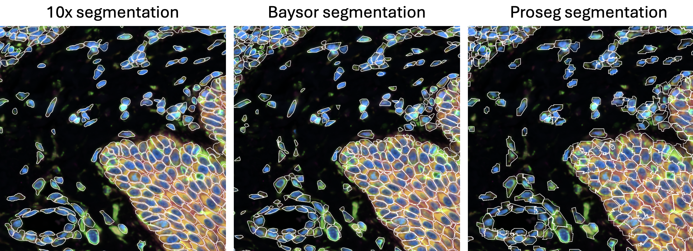
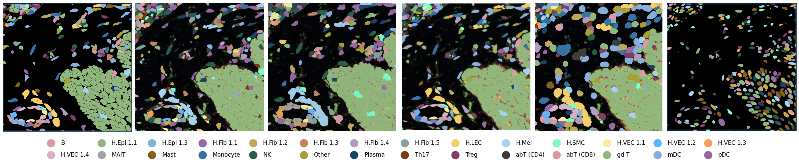
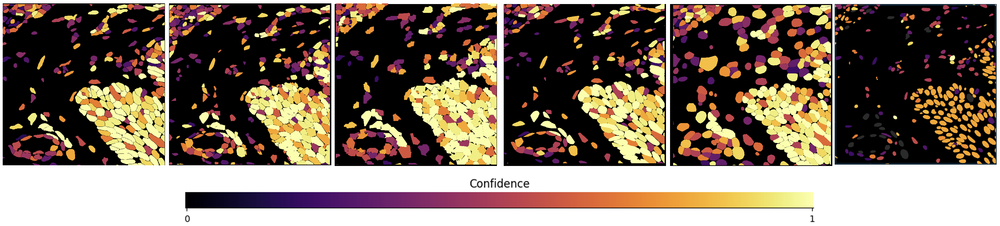

# Spatial Segmentation Wizard


An interactive pipeline for running and benchmarking spatial transcriptomics segmentation methods on HPC clusters via SLURM. Every method runs inside a single Singularity container, so there is nothing to install beyond the container itself.

A Docker container is on the way, along with a reference-based classifier that annotates cells for downstream QC. Stay tuned for more! ✨🪄💫✨

Suggestions for QC elements or methods to add are always welcome!

<br clear="left">

## Overview

The pipeline puts every segmentation method behind one interactive wizard. Point it at your data, pick your methods, and it generates and submits all the SLURM jobs — one per sample per method — chaining the dependencies so QC runs once segmentation is done.

## Comparisons
Every new segmentation mask can be loaded into Xenium Explorer for a quick visual check.
<p align="center">
  
</p>

#### Annotations:
Given a reference dataset, the classifier also labels cell types and reports how confident it is in each call. It uses rank-based gradient boosting, which keeps annotation fast enough to run on every method.
<p align="center">
  
</p>
<p align="center">
  
</p>

## Current Status
**Working:**
- **ProSeg** — probabilistic segmentation with full Explorer export ([paper](https://www.nature.com/articles/s41592-025-02697-0))
- **Baysor** — Bayesian transcript-based segmentation, dask-parallelized ([paper](https://www.nature.com/articles/s41587-021-01044-w))
- **Xenium baseline** — native Xenium segmentation, loaded as the comparison reference ([docs](https://www.10xgenomics.com/support/software/xenium-onboard-analysis/latest/algorithms-overview/segmentation))
- **Cellpose** — neural network that grows cell boundaries out from the nuclear mask ([paper](https://www.nature.com/articles/s41592-020-01018-x))
- **StarDist** — deep-learning detection of star-convex polygons ([paper](https://arxiv.org/abs/1806.03535))
- **ComSeg** — KNN point-cloud clustering over transcript positions ([paper](https://www.nature.com/articles/s42003-024-06480-3))
- **FastReseg** — R-based post-hoc refinement that matches cells against a reference ([paper](https://www.nature.com/articles/s41598-025-08733-5))
- **QC report** — multi-page PDF comparing every method that produced output
  - Basic metrics: cell count, genes/cell, counts/cell, % transcripts captured
  - Morphological metrics: cell area, elongation, circularity, compactness, eccentricity, solidity, convexity, density, nuclear ratio
  - Segger contamination metrics (MECR)
  - All metrics computed from segmentation boundary geometry in Python (shapely)
  - Guide pages interleaved with the data pages for interpretation context
- **Notifications** — one email when the run is submitted and a summary when it finishes, with per-job status and the QC PDFs attached
- **Interactive wizard** — config generation, sample discovery, job preview, and SLURM submission

**In progress:**
- Reference-based cell type classifier — scripts are in place, validation ongoing

## Supported Methods

| Method | Type | Status |
|--------|------|--------|
| **ProSeg** | Probabilistic (Rust, via SOPA) | ✓ Working |
| **Baysor** | Bayesian transcript-based (Julia, via SOPA) | ✓ Working |
| **Cellpose** | Neural network (Python, via SOPA) | ✓ Working |
| **StarDist** | Deep learning nuclear segmentation | ✓ Working |
| **ComSeg** | KNN-based point cloud | ✓ Working |
| **FastReseg** | Post-hoc refinement (R) | ✓ Working |
| **BIDCell** | Deep learning (PyTorch) | Coming soon |
| **Bering** | Graph-based learning for transcript localization | Coming soon |
| **Segger** | Heterogeneous graph neural network for link prediction | Coming soon |

Methods marked *coming soon* appear in the wizard but cannot be selected yet — they are packaged in the container but not validated end to end.

## Quick Start

```bash
pip install pyyaml  # only dependency outside the container

# Interactive wizard — walks you through everything:
python segmentation_wizard.py

# Or use an existing config:
python segmentation_wizard.py --config config/my_config.yaml

# List the samples a config would pick up, without generating anything:
python segmentation_wizard.py --config config/my_config.yaml --list
```

## Configuration

Everything cluster-specific — container runtime, GPU resource string, partition, account, bind paths — lives in `config/site.yaml`. Edit that one file to run on a different HPC. Every key has a working default, so you only change what differs from the defaults.

## Output

Results are written into `{method}_reseg/` folders alongside your raw data. Raw data is never modified. Each completed sample produces:

| File | Description |
|------|-------------|
| `{sample_id}.h5ad` | AnnData count matrix |
| `cells.zarr.zip` | Cell boundaries for Xenium Explorer |
| `cell_feature_matrix.zarr.zip` | Count matrix for Explorer |
| `run_metadata_{method}.json` | Timing, parameters, SLURM job ID |
| `annotations.csv` | Cell types assigned from the reference dataset |
| `confidence.csv` | Per-cell confidence in those annotations |

QC output per slide:
- `qc_report.pdf` — comparative report, emailed when the run finishes
- `morpho_{method}.csv` — per-cell morphological metrics
- `cellspa_{method}.csv` — count-based QC summary

## Requirements

- **Local:** Python 3.7+ with `pyyaml`
- **HPC:** SLURM, a container runtime (Singularity or Apptainer), and the built `.sif`
- **Notifications:** `sendmail` available on the cluster
